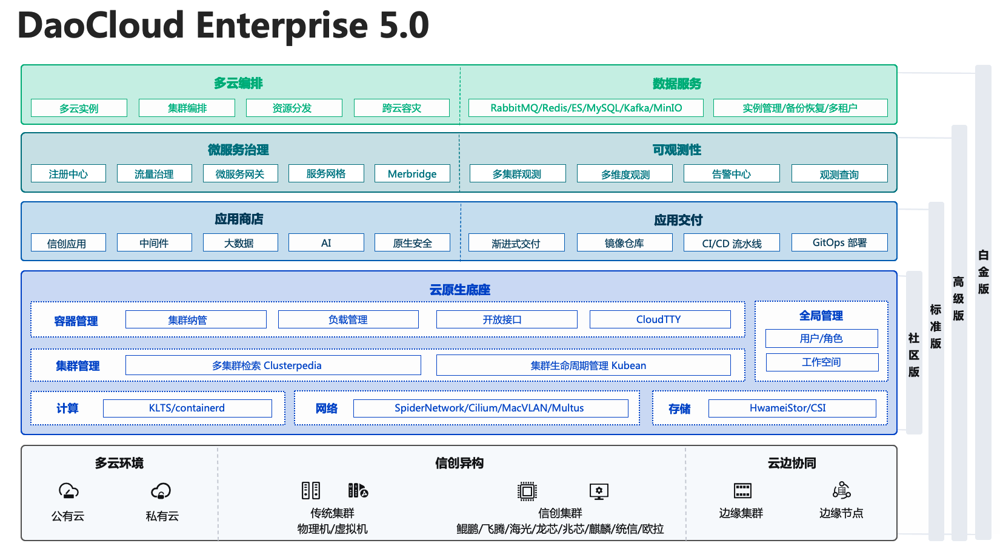
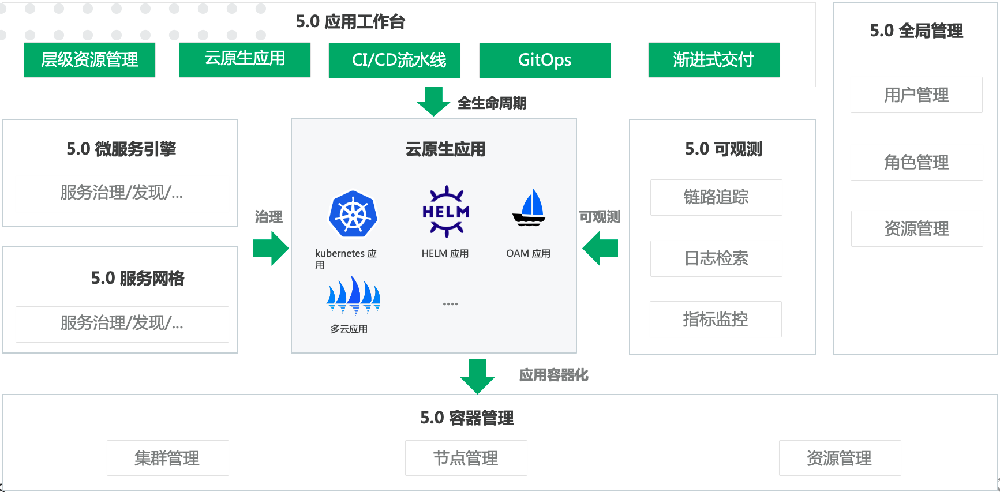

## DCE 5.0 doc
https://docs.daocloud.io/dce/what/

## 功能

1. **多云编排**
    - 多云编排 Kairship（Kubernetes Airship）是一个以应用为中心、开箱即用的多云应用编排平台。 多云编排实现了多云和混合云的集中管理，提供跨云的应用部署、发布和运维的能力；支持基于集群资源的应用弹性扩缩，实现全局负载均衡；提供了故障恢复的能力，彻底解决多云应用灾备的问题。

    - 云的种类：
        1. 公有云：一般由第三方提供商拥有和运营。组合或租户共享相同的硬件、存储和网络设备。
            - 优势：
                - 成本低
                - 无需自己维护
                - 高可靠
        2. 私有云：专门为一个企业或组织提供服务。位于组织或第三方。
            - 优势：
                - 灵活性更强
                - 控制力更强

    - 云的部署种类：
        1. 单云：只在一个云端部署应用
        2. 混合云：对接私有云和公有云
        3. 多云：多个私有云，多个公有云
   
2. **数据中间件服务**
   - 专为有状态应用设计的云原生本地存储能力，满足中间件高 I/O 的存储需求，提升运维管理效率。精选各类数据库、分布式消息和日志检索等中间件， 提供多租户、部署、观测、备份、运维操作等全生命周期的中间件管理能力，实现数据服务的自助化申请、弹性扩展、高并发处理和稳定高可用。
  
   - 用户可以使用的数据服务：
        1. Elasticsearch 搜索服务：目前首选的全文搜索引擎
        2. Kafka 消息队列：常用于消息传输的数据管道
        3. MinIO 对象存储：一款非常热门的轻量对象存储方案
        4. MySQL 数据库：最流行的开源关系型数据库之一
        5. RabbitMQ 消息队列：常用于交易数据的传输管道
        6. Redis 缓存服务：一种内存数据库
        7. PostgreSQL 数据库：最流行的开源关系型数据库之一

3. **微服务治理**
    - 提供非侵入式流量治理功能，支持无感接入传统微服务、云原生微服务和开源微服务框架，实现企业现有微服务体系及新旧微服务体系的融合治理， 支持微服务从开发、部署、接入、观测、运维的全生命周期管理，提供高性能云原生微服务网关，保证微服务应用的连续可用性；引入自主开源的 eBPF 网格加速技术，全面提高流量转发效率。
  
    - 微服务：
        - 微服务是一种开发软件的架构和组织方法，其中软件由通过明确定义的 API 进行通信的小型独立服务组成。
        - 比整体式架构轻量，便于服务进行更新、部署和扩展。
        - 自主性：不影响其他服务的功能，全部通过API进行通信。

    - 非侵入式流量治理功能：
        - 非侵入式流量治理功能旨在通过使用智能软件技术，直接在现有网络基础设施上实施流量管理策略，而无需对网络进行显著更改或引入额外设备。传统的流量治理功能很可能改变网络配置，加大维护复杂度。

    - 无感接入传统微服务：
        - 代码不用重大修改就可以接入传统微服务。

    - 服务网格：
        - 服务网格是专门的基础设施层，包含了组成这类体系结构的微服务网络。 服务网格不仅描述了这个网络，而且还描述了分布式应用程序组件之间的交互。 所有在服务之间传递的数据都由服务网格控制和路由。 
        - 服务网格是一种具备高性能、高易用性的全托管服务网格产品，通过提供完整的非侵入式的微服务治理方案，能够统一治理多云多集群的复杂环境， 以基础设施的方式为用户提供服务流量治理、安全性治理、服务流量监控、以及传统微服务（SpringCloud、Dubbo）接入。

    - eBPF：
        - extended Berkeley Packet Filter, linux内核自带的组件，可以在内核中运行沙盒程序。一般来说，要向内核添加新功能，需要修改内核源代码或者编写 内核模块 来实现。而 eBPF 允许程序在不修改内核源代码，或添加额外的内核模块情况下运行。
4. **可观测性**
    - 基于日志、链路、指标、eBPF 等技术手段，全面采集服务数据，深入获取请求链路信息，动态观测、多维度掌控集群、节点、应用和服务的实时变化， 通过统一控制面实现所有集群及负载观测数据的查询，引入拓扑分析技术可视化掌握应用健康状态，实现秒级故障定位。

    - 主要功能如下：
        1. 提供容器、服务、节点和集群等多维度的监控
        2. 支持查询 CPU、内存、存储、网络等监控指标
        3. 集成 Grafana，提供精选的开源仪表盘 
            
            - *Grafana：是由 Grafana Labs 开发的一个开源交互式数据可视化平台，用户在该平台可以通过表格和图像查看自己的数据，并将这些表格和图像统一在一个（或多个）控制面板上，以更容易说明和理解。*
            - *仪表盘：Dashboard*

        4. 支持集群工作负载日志，系统日志和 Kubernetes 事件的采集和查询
        5. 支持单条日志的上下文查询
        6. 以集群为维度生成服务拓扑，查看服务间调用关系
        7. 侵入式链路采集，支持查询服务的实时 RPS、错误率、时延等关键指标

            - *RPS: Request per second*

        8. 提供开源的聚合链路查询

            - *聚合链路：多个数据信道结合成一个信道以达到一个更高宽带的链路。*

        9. 提供开箱即用的告警规则

            - *告警规则：一个返回值是布尔值的 PromQL 表达式，它描述了指标或自定义指标是否处于阈值范围中，如果不满足将产生一条告警事件。*
            - *PromQL: Prometheus 内置的数据查询语言，其提供对时间序列数据丰富的查询，聚合以及逻辑运算能力的支持。 并且被广泛应用在Prometheus 的日常应用当中，包括对数据查询、可视化、告警处理当中。*

        10. 支持自定义指标、日志等告警
        11. 支持灵活的配置告警级别、阈值、通知对象等
        12. 提供邮箱、企业微信、钉钉、Webhook 等多种通知方式

            - *通知：由系统通过邮件等渠道发送给用户的告警事件信息*

        13. 持久化存储指标、日志、链路数据
  
5. **应用商店**
    - 收录来自大数据、AI、中间件等十大领域生态伙伴的软件产品，实现生态技术、产品、运营服务等能力的整合，提供开箱即用的生态应用软件，面向企业实际业务需求，打造完整的解决方案体系。
  
6. **应用交付**
    - 通过一致性可推广的应用交付流程实现自助式上云，支持柔性租户体系，动态适配用户组织架构规划和实时资源分配，基于云原生化的 CI/CD 流水线，集成丰富的工具链并支持流水线高效并发执行流转， 自动化完成应用的构建、部署，创新性引入 Gitops、渐进式交付能力体系，实现应用更精细的管理运维。

    - 应用交付：利用相应的网络优化/加速设备，确保用户的业务应用能够快速、安全、可靠地交付给内部员工和外部服务群。要保证可靠性、可用性和安全性。
  
7. **信创异构**
    - 采用信创云原生技术架构，兼容国产芯片及服务器，支持信创操作系统及信创应用生态体系，屏蔽底层异构基础设施的复杂性，把传统操作系统从需要长期积累的软件生态兼容适配中解放出来， 实现混合异构集群的灵活调度，保证信创应用运行环境的稳定高可靠，助力信创进程进一步提速。
  
    - 异构：
        - 计算机的架构可以按照指令集划分或者按照内存结构划分，不同的计算机架构就是异构。
    - 信创：
        - 信创是信息技术应用创新。 信创是“信息技术应用创新”的简称。

8. **云边协同**
    - 将云原生能力延伸至边缘，采用边缘集群、边缘节点模式，将数据中心算力下移，端设备算力上移，统一管控和调度离散、异构的计算资源，解决在海量边、端设备上统一完成大规模应用交付、运维、管控的诉求，实现云边的真正一体化。
    - 云边协同将分解之后的任务片段分发给网络边缘端进行计算。

9.  **云原生底座**
    - 提供云原生计算、网络、存储等能力，兼容各种集群接入，支持集群从部署、版本升级、证书变更、配置变更、回收等全生命周期管理，突破 K8s API 性能瓶颈，实现企业超大规模用户并发使用多集群。 针对企业环境，提供场景化的网络方案，实现当前企业网络基础设施复用的最大化，降低企业使用云原生应用门槛。

## 架构

1. **全局管理**
    - 全局管理是以用户为中心的综合性服务板块，包含用户与访问控制、企业空间、审计日志、平台设置等基础服务模块。

        - *用户与访问控制：帮助用户安全管理资源的访问权限。您可以通过用户与访问控制创建、管理、删除用户/用户组，并灵活配置用户/用户组权限，来完成用户职能权限的划分。*

        - *企业空间：具有层级结构和访问权限控制的资源隔离单元。您可以按照企业开发环境、部门结构等设置层级结构，并控制哪些人对哪些资源具有访问权限。*

        - *审计日志：提供资源的操作记录。通过操作记录您可以快速实现安全分析、资源变更、问题定位等。*

        - *平台设置：通过平台安全策略、邮件服务器、外观定制等，实现用户信息的安全性和平台的个性化。*

    - 优势：
        1. 综合性汇总式服务：将平台的基础服务模块汇聚在一起，减少菜单切换和功能分散带来的困扰，使平台管理员在一个菜单下就能够完成基础性平台设置和用户管理。
        2. 用户与租户相结合：通过扁平化用户、用户组管理和层级式租户（工作空间）协作，多维度多场景实现基于平台的访问控制以及基于资源的权限划分。
        3. 个性化定制：支持个性化定制平台外观，包括登录页定制和顶部导航栏定制，通过可视化页面轻轻松松配置一个属于您的个性化平台。'
        4. 简化操作，上手即用：预先为用户完成了绝大多数的平台设置，包括密码规则配置、会话超时策略等，简化用户操作，实现上手即用。

2. **容器管理**
    1. 集群管理
        - 通过 Web UI 快速部署集群和搭建云平台
        - 统一管理
        - 一键升级
        - 集群高可用（缩短维护和系统崩溃所导致的停机时间）
        - 集群全生命周期管理
        - 开放式API
    2. 应用管理
        - 一站式部署，实现应用的全生命周期管理
        - 应用负载的弹性伸缩
        - 跨集群负载统一管理能力
    3. 策略管理
        - 支持以命名空间或集群粒度制定网络策略、配额策略、资源限制策略、灾备策略、安全策略。

3. **可观测性**
   
    - 参考上文

4. **应用工作台**
   
    应用工作台是基于容器的 DevOps 云原生应用平台，提供了 DCE 5.0 应用创建的统一入口。

    1. 层级多租户资源管理
        - 以工作空间作为最小的租户单元，不仅支持单集群的独享资源的能力，还支持跨集群共享资源的能力
    2. 以云原生应用为中心
        - 支持云原生场景下的“多形态”的云原生应用，包括 Kubernetes 原生应用、Helm 应用、OAM 应用等。 能够接入 SpingCloud、Dubbo、ServiceMesh 框架的微服务应用，实现微服务的治理，与 DCE 5.0 的微服务引擎、服务网格无缝集成。 支持云原生应用的全生命周期管理，例如应用的扩缩容、日志、监控查看、更新应用等等。
    3. 高效的持续集成
        - 支持 Jenkins 和 Tekton 双流水线引擎系统。采用图形化方式编辑流水线，做到所见即所得的效果。可以用不同来源的代码构建应用。
    4. 安全自动化渐进式交付
        - 应用工作台引入一种为云原生应用实现持续部署的理念 – GitOps，全面拥抱 GitOps，以集成渐进式交付组件 Argo Rollout，支持灰度发布，从而提高应用交付的稳定性和效率。

    - 注释：
        - *CI/CD 流水线：持续集成（CI）是构建软件和完成初始测试的过程。持续部署（CD）是将代码与基础设施相结合的过程，确保完成所有测试并遵循策略，然后将代码部署到预期环境中。*
        - *GitOps：GitOps 是一种新的软件开发范式，承诺简化和完全自动化软件部署过程。 GitOps 不依赖IT人员或笨拙的脚本来配置环境，而是将所有环境定义成代码，并通过一致和可预测的方式一起部署环境和应用程序。*

5. **微服务引擎**

    1. 微服务注册发现：统一纳管传统微服务和云原生微服务，实现从传统微服务生态向云原生微服务生态的平稳过渡，助力企业走向云原生化。
    2. 微服务流量治理：在流量治理层面，采用线上流量治理方案，可以快速与主流开源微服务框架集成，用 Sentinel 和 Mesh 解决不同生产情况下的痛点。
        - *Sentinel：一个安全信息和事件管理(SIEM) 解决方案，同时也是一个合规性监视解决方案。 Sentinel 可自动监视最复杂的IT 环境，并提供所需的安全性以保护IT环境。*
        - *Mesh：无限网格网络*
    3. 微服务配置中心：Nacos 托管注册中心可作为微服务的配置管理器，可以从不同项目中抽取通用配置事先统一管理，也可以为同一项目应用多个不同配置，实现差异化管理。
        - *Nacos：发现、配置和管理微服务。Nacos 提供了一组简单易用的特性集，帮助快速实现动态服务发现、服务配置、服务元数据及流量管理。*
    4. 微服务网关：微服务网关肩负管理微服务南北流量管控的重要作用，提供 API 管理、接口限流、多种策略安全认证、黑白名单、路由转发、MockAPI 等能力，同时提供企业级高性能和高扩展的云服务能力。

6. **服务网格**

    - 服务网格是基于 Istio 开源技术构建的面向云原生应用的下一代服务网格。

    - 服务网格是一种具备高性能、高易用性的全托管服务网格产品，通过提供完整的非侵入式的微服务治理方案，能够统一治理多云多集群的复杂环境， 以基础设施的方式为用户提供服务流量治理、安全性治理、服务流量监控、以及传统微服务（SpringCloud、Dubbo）接入。

    - DCE5.0 产品优势：
        1. 简单易用
            - 无需修改代码、安装代理
        2. 策略化的智能路由与弹性流量管理
        3. 图形化应用全景拓扑，流量治理可视化
        4. 性能增强，可靠性增强
        5. 多云多集群、多基础设施
        6. 协议扩展
            - 扩展Dubbo协议的支持
        7. 传统 SDK 集成

7. **云原生网络**

    - 云原生网络用于应用的多态网络通信、跨集群通信和跨CNI的Pod间通信
    
    - DCE 5.0 云原生网络基于多个开源技术构建，不仅提供单个 CNI 网络支持，也提供多个 CNI 网络的组合方案。
        - 方案一：Cilium + MacVLAN/SpiderFlat + SpiderPool + Multus
            1. 此方案适用于高内核版本（4.19.57+）的 Linux 操作系统。
        - 方案二：Calico + MacVLAN/SpiderFlat + SpiderPool + Multus
            1. 此方案适用于低内核版本的 Linux 操作系统。

    - 注释：
      - *CNI: 容器网络接口（Container Network Interface），简称 CNI，是 CNCF 旗下的一个项目，由一组用于配置 Linux 容器的网络接口的规范和库组成，同时还包含了一些插件。CNI 仅关心容器创建时的网络分配，和当容器被删除时释放网络资源。*
      - *Cilium: 一个开源软件，用于透明地提供和保护使用Kubernetes，Docker和Mesos等Linux容器管理平台部署的应用程序服务之间的网络和API连接*
      - *MacVLAN: Linux 内核3.0 版本引入的一种虚拟网卡*
      - *SpiderFlat：专门设计用于 Underlay 底层网络，解决在集群内外通信时的复杂IP 分配问题，网络管理员可以利用 Spiderpool 划分 ippool（IP 资源池）准确管理集群内外的每个IP*
      - *Multus: 一种容器网络接口(CNI) 插件，可用于为 Kubernetes 中的 pod 创建多个网络接口*
      - *Calico: 纯三层网络框架*

8. **云原生存储**
   
    - 云原生化存储的几种类型
        1. 传统存储云原生化，此类型相对来说比较普遍， 用户可利用现有存储，并且基于传统存储的提供云原生存储能力稳定性好，SLA 强保障。
            - 通过SCI标准同Kubernetes平台对接。
                - *SCI：容器存储接口（Container Storage Interface）*
                - *SLA：服务等级协议（SLA）是一种外包和技术供应商合同*
        2. 软件定义存储云原生化
            - 基于 CSI 标准同 Kubernetes 对接。软件定义存储通过网络使用企业中的每台机器上的磁盘空间， 并将这些分散的存储资源构成一个虚拟的存储设备，数据分散在不同的存储设备中。
            - 软硬件分离
        3. 纯云原生存储
            - 此种类型的存储类型天然为云原生而生，构筑于云原生平台之上，能比较好的契合云原生特性， 并可随着应用 Pod 的迁移而迁移，具备如下特性：高可扩展性，高可用性，但相对于 通过 CSI 标准接入的传统存储可靠性低一些。

## 参考文档
1. https://docs.daocloud.io/dce/what/
2. https://azure.microsoft.com/zh-cn/resources/cloud-computing-dictionary/what-are-private-public-hybrid-clouds/#overview
3. https://zhuanlan.zhihu.com/p/575515431