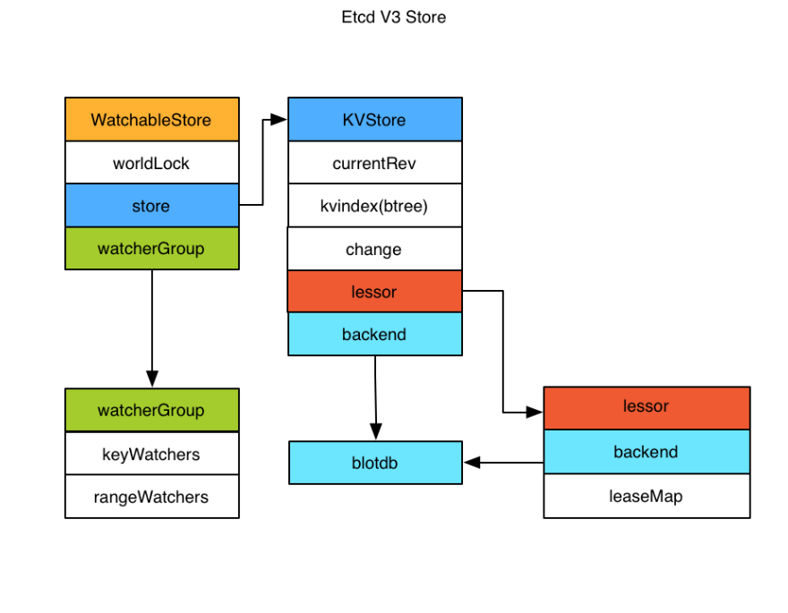

# KubernetesComponects
## etcd

### 功能
1. 基本的 key-value 存储
2. 监听机制
3. key 的过期及续约机制，用于监控和服务发现
4. 原子 CAS 和 CAD，用于分布式锁和 leader 选举 *(CAS中old_value和new_value相等则修改value为new_value; CAD中相等则删除key)

### etcd v2 & v3
- v2 和 v3 数据相互隔离（接口、存储不一样）
- v2 已经弃用

    

    - v2 是内存实现的
    - 通过 EventHistory 查看历史 event（查看 index 在 waitIndex 到 currentIndex 的 event 列表, 但是 EventHistory 最长为1000。）
    - currnetIndex 每次更变会 +1 （全局变量）
    - 过期时间只能设置在key上面，保证多个key生命周期一致比较困难
    - watcher 只能 watch 一个 key 以及其子节点，不能进行多个watch
    ---

    

    - watch 和 store 拆开实现：
      - store 由 kvindex & backend 实现：
        - kvindex 是一个 btree，负责保存 key 和 revision 之间的映射关系，加速查询 *（revision：作用域为集群，逻辑时间戳，全局单调递增，任何 key 的增删改都会使其自增）*
        - backend 可以对接多种存储，当前使用的是 boltdb（单机kv存储，支持事务，必须通过 revision 查询数据）
      - watchGroup 内包含2种 watcher：key watchers & range watchers:
        - key watchers 内每个 key 对应一组 watcher
        - range watchers 数据结构是一个 IntervalTree，便于区间查找 *（IntervalTree：http://istoney.github.io/data%20structure/2016/03/29/interval-tree）*
      - watchableStore 包含2种 watcherGroup：synced & unsynced：
        - synced 表示该 group 的 watcher 数据都已经同步完毕，在等待新的变更
        - unsynced 表示该 group 的 watcher 数据同步落后于当前最新变更，还在追赶
      - 没有 event 表内数量限制

## kube-apiserver

1. APIServer 是整个集群唯一操作etcd的入口，提供 REST API 接口。
    - 提供 https（port 6443）& http（port 8080），http API 非安全。
2. 认证(Authentication)， 授权(Authorization) & 准入控制（Admission Control）
    - **认证**：用于识别用户身份。开启TLS时，请求都需要认证。认证成功则会进入授权模块。检查客户端证书、密码、plain tokens、bootstrap tokens 以及 JWT tokens。
    - **授权**：用于确认用户权限。授权成功进入控制模块。使用 RBAC（Role-Based Access Control）
    - **准入控制**：对请求做进一步验证或添加默认参数
3. 访问方式：
    - kubectl 命令行工具
    - SDK（支持 OpenAPI 支持的编程语言）

## kube-scheduler

1. 负责分配调度 pod 到集群内的 node 上
2. 监听 kube-apiserver，watch 未绑定的 pod

### 调度策略
1. 给一个 pod 做调度时包含两个步骤：
    1. 过滤
        - PodFitsResources 过滤函数会检查候选节点的可用资源能否满足 Pod 的资源请求。过滤之后得出一个 node 列表，里面包含了所有可调度节点 *（在一个集群中，满足一个 Pod 调度请求的所有节点称之为 可调度节点 | PodFitsResources 计算宿主机的 CPU 和内存资源等是否够用）*
        - 如果没有任何一个节点能满足 Pod 的资源请求， 那么这个 Pod 将一直停留在未调度状态直到调度器能够找到合适的 Node。
    2. 打分
        - 通过优先级给可调度节点打分，选出其中得分最高的节点来运行 Pod之后，调度器将这个调度决定通知给 kube-apiserver，这个过程叫做绑定。
        -  LeastRequestedPriority 打分规则：```score = (cpu((capacity-sum(requested))10/capacity) + memory((capacity-sum(requested))10/capacity))/2```
        -  BalancedResourceAllocation 打分规则：```score = 10 -variance(cpuFraction,memoryFraction,volumeFraction)*10```

2. Taints & tolerations 用于保证 pod 不被调度到不合适的 node 上
    - Taints 应用于 node 上
        - 用法：
            ```
            # 给 node1 打上3个 taint
            kubectl taint nodes node1 key1=value1:NoSchedule
            kubectl taint nodes node1 key1=value1:NoExecute
            kubectl taint nodes node1 key2=value2:NoSchedule
            ```
    - Toleration 应用于 pod 上
        - 用法：
            ```
            # 由于没有 key2=value2:NoSchedule 无法调度到 node1 上
            tolerations:
            - key: "key1"
                operator: "Equal"
                value: "value1"
                effect: "NoSchedule"
            - key: "key1"
                operator: "Equal"
                value: "value1"
                effect: "NoExecute"
            ```
    - 三种策略：
        - **NoSchedule**：新的 Pod 不调度到该 Node 上，不影响正在运行的 Pod
        - **PreferNoSchedule**：soft 版的 NoSchedule，尽量不调度到该 Node 上
        - **NoExecute**：新的 Pod 不调度到该 Node 上，并且删除（evict）已在运行的 Pod。Pod 可以增加一个时间（tolerationSeconds）

## kube-controller-manager

- Controller Manager 由 kube-controller-manager 和 cloud-controller-manager 组成。通过 apiserver 监控整个集群的状态，并确保集群处于预期的工作状态。

### 工作原理
1. Controller Manager 负责处理进群中常规任务的后台线程（例如 Deployment 中的 spec 定义了期望的 replicas，controller-manager 会实现 pod 部署达到预期目标）
2. Controller Manager 的 client-go 发现当前资源与期望值不一致时，会触发 Event Handler。然后让相应的 Controller 去和 APIServer 对接调整。
3. Client-go 用于分发事件个各个 Controllers， List & Watch APIServer。

### 组成
1. kube-controller-manager 由一系列的控制器组成
   - Replication Controller
   - Node Controller
   - CronJob Controller
   - Daemon Controller
   - Deployment Controller
   - Endpoint Controller
   - Garbage Collector
   - Namespace Controller
   - Job Controller
   - Pod AutoScaler
   - RelicaSet
   - Service Controller
   - ServiceAccount Controller
   - StatefulSet Controller
   - Volume Controller
   - Resource quota Controller

2. cloud-controller-manager 在 Kubernetes 启用 Cloud Provider 的时候才需要，组成：
   - Node Controller
   - Route Controller
   - Service Controller

## kubelet

1. 每个 node 上都运行一个 kubelet 服务进程，默认监听10250端口。
2. 接受并执行 Master 发来的指令，管理 Pod 及 Pod 中的容器。
3. 每个 Kubelet 进程会在 API Server 上注册所在Node节点的信息，定期向 Master 节点汇报该节点的资源使用情况，并通过 cAdvisor 监控节点和容器的资源。

### 节点管理

1. 节点自注册：通过设置启动参数 --register-node 来确定自己是否向 APIServer 注册自己
2. 如果不自注册，需要手动配置 node 资源信息
3. 定时向 APIServer 发送节点新消息， APIServer 在收到新消息后，将信息写入 etcd

### Pod 管理
1. 获取 pod 清单
    - Kubelet 通过 PodSpec 来获取 pod 清单。*（PodSpec 用于描述 pod，是 YAML/JSON 对象）*
    - 通过一下方法向 kubectl 提供清单：
        1. **文件**：启动参数 --config 指定的配置目录下的文件 (默认 /etc/kubernetes/manifests/)。该文件每 20 秒重新检查一次（可配置）
        2. **HTTP endpoint**：启动参数 --manifest-url 设置。每 20 秒检查一次这个端点（可配置）
        3. **APIServer**：通过 APIServer 监听 etcd 目录， 同步 pod 清单（主要方式）
            - Kubelet 通过 API Server Client(Kubelet 启动时创建) 使用 Watch 加 List 的方式监听 "/registry/nodes/$当前节点名" 和 “/registry/pods” 目录，将获取的信息同步到本地缓存中。
            - Kubelet 监听 etcd，所有针对 Pod 的操作都将会被 Kubelet 监听到。如果发现有新的绑定到本节点的 Pod，则按照 Pod 清单的要求创建该 Pod。
        4. **HTTP server**：kubelet 侦听 HTTP 请求，并响应简单的 API 以提交新的 Pod 清单
   

## kube-proxy

1. 负责监听 APIServer 中 service 和 endpoint 的变化情况
2. 通过 iptables 等来达到服务的负载均衡

### 实现
1. **userspace**：在 namespace 中监听一个端口，所有服务通过 iptables 转发到此端口，然后在其内部负载均衡到实际的 Pod
2. **iptables**：完全以 iptables 规则的方式来实现 service 负载均衡
3. **ipvs**：采用增量式更新，并可以保证 service 更新期间连接保持不断开
4. **winuserspace**：同 userspace，但仅工作在 windows 节点上


## 参考文档
1. https://kubernetes.feisky.xyz/concepts/components/
2. https://kubernetes.io/zh-cn/docs/home/  