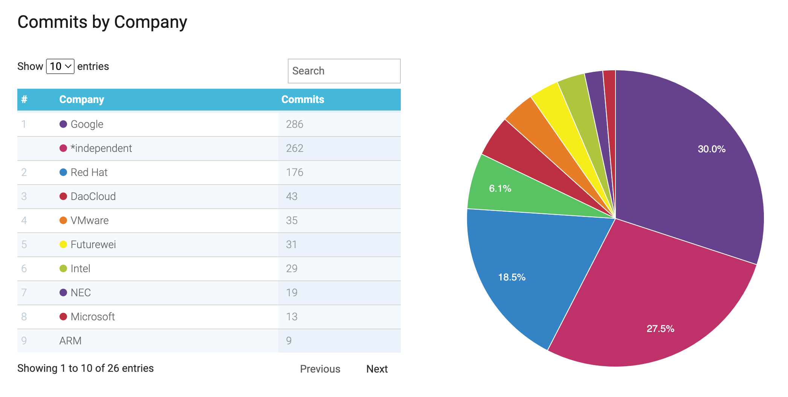

# Kubernetes 1.24 - 走向成熟的 Kubernetes

`Kubernetes 1.24` 即将发布，在即将到来的新版本中，我们看到 Kubernetes 作为容器编排的事实标准，正愈发变得成熟，有12项功能都更新到了稳定版本。另外，讨论了很久的弃用 Dockershim 也终于在这个版本画上了句号。虽然在新版本中，我们没有看到太多重磅的特性，但是还是引入了很多实用的功能，比如 StatefulSets 支持批量滚动更新，NetworkPolicy 新增 NetworkPolicyStatus 字段方便进行故障排查等。让我们一起看一下！

## 重磅改动
* kubernetes 正式移除 Dockershim 支持
* TODO: 请加上大家觉得重磅的改动！！！

## 升级提醒
* ServiceAccount token 现在不会以 Secret 的方式自动生成，而是通过 TokenRequest API 的方式获取 token 信息，并以投射卷的方式保存 [详见](#LegacyServiceAccountTokenNoAutoGeneration)
* kubernetes 正式移除 Dockershim 支持，请使用其他容器运行时替代 ([KEP-1985](https://github.com/kubernetes/enhancements/pull/1985))
* 拓扑调度目前会移除不符合节点选择和节点亲和性的节点，可能会导致原本可以调度的 Pod 现在变成了不可调度

## 功能特性

### API
* 默认开启 OpenAPI V3

    * Stage: Beta
    * FeatureGateName: OpenAPIv3Enabled
    * Default: On

    默认开启 OpenAPI V3，新增端点 `/openapi/v3/apis/{group}/{version}`

* ServerSideFieldValidation 升级至 Beta 版本 ([KEP-2885](https://github.com/kubernetes/enhancements/issues/2885))

    * Stage: Beta
    * FeatureGateName: ServerSideFieldValidation
    * Default: On

    当前版本我们可以使用 `kubectl --validate=true` 来校验请求中字段是否合法，该特性将这种能力迁移到了 APIServer，避免多个客户端重复实现，同时规避了客户端升级比较慢的问题。

* OpenAPI Enum 类型支持升级至 Beta 版本 ([KEP-2887](https://github.com/kubernetes/enhancements/issues/2887))

    * Stage: Beta
    * FeatureGateName: OpenAPIEnum
    * Default: On

    OpenAPI 支持识别 +enum，并自动生成文档。

### Apps
* IndexedJob 升级至稳定版本 ([KEP-2214](https://github.com/kubernetes/enhancements/issues/2214))

    * Stage: GA
    * FeatureGateName: IndexedJob
    * Default: On

    IndexedJob 升级至稳定版本，该特性支持带有索引完成信息的 Job，使得每个 Pod 能识别出要处理整个任务的哪个部分。

* JobReadyPods 升级至稳定版本 ([KEP-2879](https://github.com/kubernetes/enhancements/issues/2879))

    * Stage: GA
    * FeatureGateName: JobReadyPods
    * Default: On

    JobReadyPods 升级至稳定版本，该特性在 JobStatus 原有字段的基础上新增 Ready 字段，用于记录所有处于 Ready 状态的 pod 数量。

* StatefulSets 增加 `MaxUnavailable` 字段，支持同时下线多个 Pod 达到快速滚动更新的目的 ([KEP-961](https://github.com/kubernetes/enhancements/issues/961))

    * Stage: Alpha
    * FeatureGateName: MaxUnavailableStatefulSet
    * Default: Off

    该特性早在2018年就被提出，直到最近完成了 Alpha 版本的功能开发。主要用于 StatefulSet 滚动更新的时候，通过配置 maxUnavailable 字段，支持同时下线多个 pod，达到快速滚动更新的目的。

* 新增 StatefulSet 非优雅故障转移功能 ([KEP-2268](https://github.com/kubernetes/enhancements/tree/master/keps/sig-storage/2268-non-graceful-shutdown))

    * Stage: Alpha
    * FeatureGateName: NonGracefulFailover
    * Default: Off

    当 kubelet 监测到节点关闭的事件，会进行优雅关机，但是在一些特殊场景下，如没有触发 kubelet inhibitor 的锁机制，或者用户错误配置了 ShutdownGracePeriod 和 ShutdownGracePeriodCriticalPods 的时长，kubelet 可能会遗漏掉该事件，此时 StatefulSet 的 pod 会卡在 terminating 阶段。遇到此场景，NonGracefulFailover 会强制删除 pod，并解绑存储卷，让 pod 转移到其他节点。

* CronJob 增加市区的支持 ([KEP-3140](https://github.com/kubernetes/enhancements/issues/3140))

    * Stage: Alpha
    * FeatureGateName: CronJobTimeZone
    * Default: Off

    该特性允许用户在创建 CronJob 时可以定义时区。

### Auth
* CSRDuration 升级至稳定版本

    * Stage: GA
    * FeatureGateName: CSRDuration
    * Default: On

    `CertificateSigningRequestSpec` 新增了一个字段 `ExpirationSeconds` 来定义证书过期时间而不是默认一年。

* StatefulSetsLegacyServiceAccountTokenNoAutoGeneration 升级至 Beta 版本([KEP-2799](https://github.com/kubernetes/enhancements/issues/2799))

    * Stage: Beta
    * FeatureGateName: LegacyServiceAccountTokenNoAutoGeneration
    * Default: On

    现在，Pod 的 ServiceAccount token 可以通过 TokenRequest API 获取，并以投射卷的方式保存下来。放弃了以往为 ServiceAccount 自动创建 Secret 来保存 token 信息这种不安全的方式。

### Network
* NetworkPolicy 新增 NetworkPolicyStatus 字段 ([KEP-2943](https://github.com/kubernetes/enhancements/issues/2943))

    * Stage: Alpha
    * FeatureGateName：NetworkPolicyStatus
    * Default: Off

    NetworkPolicy 增加 status 状态字段，允许 Network Policy providers 添加相应状态信息供终端用户进行查看和定位问题。

* ServiceLBNodePortControl 升级至稳定版本 ([KEP-1864](https://github.com/kubernetes/enhancements/issues/1864))

    * Stage: GA
    * FeatureGateName: ServiceLBNodePortControl
    * Default: On

    Kubernetes 类型为 LoadBalancer 的 Service 总是会为每一个 Service 分配一个 NodePort，但这并不总是必要的，如 `MetalLB`，该特性将这种功能变成用户可选的。

### Node
* KubeletCredentialProvider 升级至 Beta 版本([KEP-2133](https://github.com/kubernetes/enhancements/issues/2133))

    * Stage: Beta
    * FeatureGateName: KubeletCredentialProvider
    * Default: On

    Kubernetes 正致力于将内置的特定云提供商的相关代码剥离出去。KubeletCredentialProvider 希望通过灵活可拓展的插件机制动态接入任何云厂商的镜像注册认证，并将目前内置的 ACR，ECR，GCR 相关实现移除。

* IdentifyPodOS 升级至 Beta 版本 ([KEP-2802](https://github.com/kubernetes/enhancements/issues/2802))

    * Stage: Beta
    * FeatureGateName: IdentifyPodOS
    * Default: On

    该特性为 PodSpec 增加一个表示当前操作系统的字段 `OS`，以满足调度的需求。

* GRPCContainerProbe 升级至 Beta 版本 ([KEP-2727](https://github.com/kubernetes/enhancements/issues/2727))

    * Stage: Beta
    * FeatureGateName: GRPCContainerProbe
    * Default: On

    支持原生的 gRPC 探针。

* AnyVolumeDataSource 升级至 Beta 版本 ([KEP-1495](https://github.com/kubernetes/enhancements/issues/1495))

    * Stage: Beta
    * FeatureGateName: AnyVolumeDataSource
    * Default: On

    该特性允许使用任何自定义的资源来做作为 PVC 中的 DataSource。

* 基于 Pod 优先级的节点优雅关机功能升级至 Beta 版本 ([KEP-2712](https://github.com/kubernetes/enhancements/issues/2712)

    * Stage: Beta
    * FeatureGateName: PodPriorityBasedGracefulNodeShutdown
    * Default: Off

    当节点进入优雅关机流程，该特性会将 Pod 的优先级纳入考虑，高优先级的 Pod 将会有更多的时间来终止运行。

* Pod Overhead 功能升级至稳定版本 ([KEP-688](https://github.com/kubernetes/enhancements/issues/688))

    * Stage: GA
    * FeatureGateName: PodOverhead
    * Default: On

    沙箱容器运行时会有一些不容忽视的资源消耗，比如 Kata 容器运行时会包括一个 kernel 内核，一个 kata 客户端，以及一些初始化程序，他们所消耗的资源已经无法忽视。Pod Overhead 提供了一种机制，可以为特定运行时设置他们所需要的资源，并在调度、资源限额、资源约束时将他们考虑在内，实现更精确的管控。

* SuspendJob 升级至稳定版本 ([KEP-2232](https://github.com/kubernetes/enhancements/issues/2232))

    * Stage: GA
    * FeatureGateName: SuspendJob
    * Default: On

    该特性为 Job 增加了暂停/恢复执行功能。

### Scheduling
* DefaultPodTopologySpread 升级至稳定版本 ([KEP-1258](https://github.com/kubernetes/enhancements/issues/1258))

    * Stage: GA
    * FeatureGateName: DefaultPodTopologySpread
    * Default: On

    该特性为使用 `.Spec.TopologySpreadConstraints` 功能的用户提供默认的 PodTopologySpread 配置，配置如下：

        defaultConstraints:
        - maxSkew: 3
            topologyKey: "kubernetes.io/hostname"
            whenUnsatisfiable: ScheduleAnyway
        - maxSkew: 5
            topologyKey: "topology.kubernetes.io/zone"
            whenUnsatisfiable: ScheduleAnyway

* PodAffinityNamespaceSelector 升级至稳定版本 ([KEP-2249](https://github.com/kubernetes/enhancements/issues/2249))

    * Stage: GA
    * FeatureGateName: PodAffinityNamespaceSelector
    * Default: On

    默认情况下，Pod 亲和性和反亲和性都是作用在 Pod 所在的命名空间，该特性提供了穿越命名空间的能力。

* 拓扑调度新增 MinDomains 字段约束拓扑域数量 ([KEP-3022](https://github.com/kubernetes/enhancements/issues/3022))

    * Stage: Alpha
    * FeatureGateName: MinDomainsInPodTopologySpread
    * Default: Off

    调度插件 PodTopologySpreadPlugin 新增 MinDomains 字段约束拓扑调度时的最小拓扑域数量，默认值为1。

* NonPreemptingPriority 升级至稳定版本 ([KEP-902](https://github.com/kubernetes/enhancements/issues/902))

    * Stage: Beta
    * FeatureGateName: NonPreemptingPriority
    * Default: On

    该特性为 PriorityClass 增加 Preempting 字段，来控制设置为该 PriorityClass 的 Pods 是否进行抢占调度。

* PreferNominatedNode 升级至稳定版本 ([KEP-1923](https://github.com/kubernetes/enhancements/issues/1923))

    * Stage: GA
    * FeatureGateName: PreferNominatedNode
    * Default: On

    PreferNominatedNode 优化了调度流程，被 Pod 提名的节点会优先被评估，如果评估不通过，则继续走标准的调度流程。

### Storage
* HonorPVReclaimPolicy 升级至 Beta 版本 ([KEP-2644](https://github.com/kubernetes/enhancements/issues/2644))

    * Stage: Beta
    * FeatureGateName: HonorPVReclaimPolicy
    * Default: On

    PV 可以指定 Reclaim Policy 回收策略，当 PVC 优先删除，PV 回收策略会生效，但是当 PV 先于 PVC 被删除，回收策略则不会生效，该特性修复了这个 bug，使得回收策略永远都生效。

* CSIMigrationAzureDisk 升级至 Beta 版本 ([KEP-1490](https://github.com/kubernetes/enhancements/issues/1490))

    * Stage: GA
    * FeatureGateName: CSIMigrationAzureDisk
    * Default: On

    该特性主要是将 Azure Disk 相关代码移出 Kubernetes 主库

* ExpandInUsePersistentVolumes 升级至稳定版本 ([KEP-657](https://github.com/kubernetes/community/pull/657))

    * Stage: GA
    * FeatureGateName: ExpandInUsePersistentVolumes
    * Default: On

    该特性允许用户修改 PV 大小。

* 新增 Service 动态、静态 IP 预留功能([KEP-3070](https://github.com/kubernetes/enhancements/issues/3070))

    * Stage: Alpha
    * FeatureGateName: ServiceIPStaticSubrange
    * Default: Off

    当前 ClusterIP 可以通过动态和静态两种方式配置 IP 地址，但是配置静态 IP 存在 IP 地址冲突的风险，因为现在无法在分配静态 IP 地址之前获知该 IP 是否被动态分配了。该特性引入 `--service-cluster-ip-range` flag 将 IP 分为静态和动态 IP 地址集，静态 IP 地址集最少有16个 IP 地址，最多不超过 256个。当动态 IP 地址集消耗完了仍然会消耗静态 IP 地址集。通过该机制减少 IP 冲突问题。

### Cli
* kubectl 增加 子资源的支持 ([KEP-2590](https://github.com/kubernetes/enhancements/issues/2590))

    * Stage: Alpha
    * FeatureGateName: N/A
    * Default: N/A

    kubectl 的 get，patch，edit 命令增加了一个新的 flag  `--subresource` 支持获取和更新资源的 status 和 scale 字段

### Instrumentation
* 引入带有上下文信息的日志库 ([KEP-3077](https://github.com/kubernetes/enhancements/issues/3077))

    * Stage: Alpha
    * FeatureGateName: StructuredLogging
    * Default: Off

    引入可以传递上下文信息的日志库，如输出格式，日志信息级别，额外携带的值，名字等。

### Cloud Provider
* Leader Migration 升级至稳定版本 ([KEP-2436](https://github.com/kubernetes/enhancements/issues/2436))

    * Stage: GA
    * FeatureGateName: ControllerManagerLeaderMigration
    * Default: On

    Kubernetes 正致力于将特定云厂商的代码移出 Kubernetes 主库，该功能实现了一种在 `kube-controller-manager` 和 `cloud-controller-manager` 之间安全迁移特定云厂商控制器的机制。

### Cluster Lifecycle
* kubeadm `UnversionedKubeletConfigMap` 升级至 Beta 版本，并默认开启

    * Stage: Beta
    * FeatureGateName: UnversionedKubeletConfigMap
    * Default: On

    kubeadm 使用新的格式来命名保存 KubeletConfiguration 的 ConfigMap。

### 其他
* golang 升级到1.18
* 调度框架 PreFilter 接口修改了返回值，不仅返回 Status，同时返回 PreFilterResult。

## 废弃功能列表
* DynamicKubeletConfig 功能从 kubelet 中移除
* 移除 CCM 已经废弃的不安全的服务
* 废弃 `metadata.clusterName`，并将在下个 release 移除
* VSphere 废弃低于 7.0u2 的版本，vSphere CSI Driver 要求最低使用 vSphere 7.0u2，vSphere 6.7 将在2022年10月15日后放弃支持
* kubelet 废弃 `--pod-infra-container-image`  flag ，并会在未来某个版本完全移除
* `ExecCredential` 的 `Client.authentication.k8s.io/v1Alpha1` 版本已经移除，使用 v1Alpha1 版本的 client-go 需要升级到 v1 版本
* 移除已经废弃的 `ValidateProxyRedirects` 和 `StreamingProxyRedirects` 功能开关
* `RuntimeClass` API 版本 `node.k8s.io/v1Alpha1` 不再使用，v1.20 及之后的版本请使用 `node.k8s.io/v1 API`
* 移除 dashboard 的 Cluster addon
* kube apiserver 移除了对 `--master-count` 和 `--endpoint-reconciler-type=master-count` 的支持
* Service 的 annotation `tolerate-unready-endpoints` 在 v1.11 被废弃，此版本将该注释完全移除，替代方案为 `Service.spec.publishNotReadyAddresses`
* 废弃 `azure` 内置插件，取而代之使用外置插件 [kubelogin](https://github.com/Azure/kubelogin)
* kubeadm 废弃 API 版本 `kubeadm.k8s.io/v1beta2`，并会在未来某个版本完全移除
* 废弃 `Service.Spec.LoadBalancerIP` 字段，鼓励使用 annotations 字段
* kube apiserver 移除了一些不安全的 flag 支持，如 `--address`，`--insecure-bind-address`，`--port`，`--insecure-port`
* 实验性的动态日志清理功能被移除
* kube controller manager 移除了一些不安全的 flag 支持，如 `--address`，`--port`
* `CSIStorageCapacity.storage.k8s.io` 废弃了 v1beta1 版本，并将在未来某个版本废弃，鼓励使用 v1 版本
* kube scheduler 移除了不安全的 flags，`--address` 和 `--port`

## DaoCloud 社区贡献
道客DaoCloud 作为 Kubernetes 社区的活跃玩家，在v1.24版本开发过程中，参与了诸多贡献，如`PodPriorityBasedGracefulNodeShutdown`，`PodOverhead`，`DefaultPodTopologySpread` 等功能的迭代，kube-scheduler framework 框架的优化，kubelet, kubeadm 等多个 bug 修复等等, 共计参与了43个PR的贡献, 详见[贡献榜单](https://www.stackalytics.io/cncf?project_type=cncf-group&release=all&metric=commits&start_date=1641744000&end_date=1649692800&module=github.com/kubernetes/kubernetes)。

### 社区贡献排名(2022.01.10 – 2022.04.12)

也正是因为 DaoCloud 在 Kubernetes 社区的坚持耕耘，在过去的几个月中，先后有2名同学成为了 sig/node 小组的 Reviewer，有一名同学成为了 Kubernetes website 的 Approver。

未来，DaoCloud 会继续在 Kubernetes 开源社区贡献自己的力量，也欢迎有志之士加入我们，一起驶向星辰大海！

## 历史文章
- [Kubernetes v1.23 正式发布，有哪些增强？](https://mp.weixin.qq.com/s/A5GBv5Yn6tQK_r6_FSyp9A)
- [Kubernetes 1.22，颠覆你的想象：可启用 Swap，推出 PSP 替换方案，还有……](https://mp.weixin.qq.com/s/9nH2UagDm6TkGhEyoYPgpQ)
- [Kubernetes 1.21 震撼发布 | PSP 将被废除，BareMetal 得到增强](https://mp.weixin.qq.com/s/amGjvytJatO-5a7Nz4BYPw)

## 参考
* https://github.com/kubernetes/kubernetes/blob/master/CHANGELOG/CHANGELOG-1.24.md
* https://sysdig.com/blog/kubernetes-1-24-whats-new/