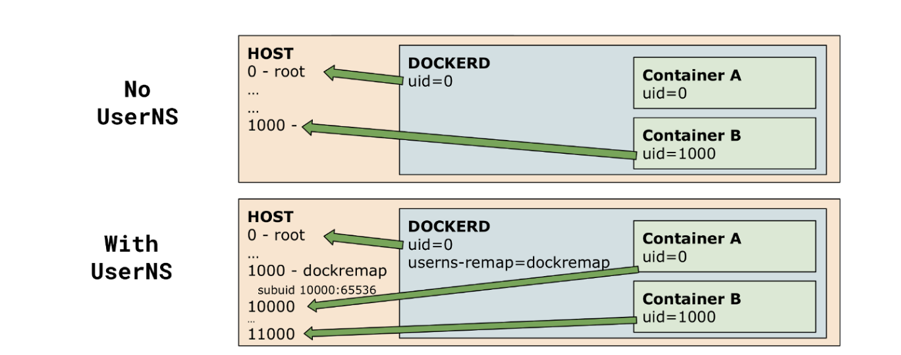
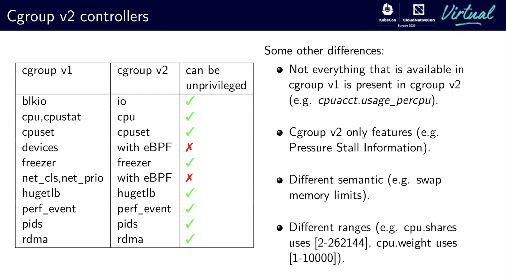

太平洋时间 2022 年 8 月 23 日，Kubernetes 1.25 正式发布。此版本距离上版本发布时隔 4 个月，是 2022 年的第二个版本。受新冠疫情和国际形势变化影响以及发布团队的全球化性质，发布过程也经历了非常大的挑战。

新版本包含 40 个 enhancements「1.24 版本 46 个、1.23 版本 45 个」其中 13 个功能升级为稳定版，10 个已有功能进行优化，另有多达 15 个全新功能以及2个废弃的功能。

Kubernetes 1.25 版本在多个方面实现重大突破，需要注意的是 PSP 在该版本中已经被移除，而替换该功能的 PodSecurity 目前已经稳定。升级的用户需要注意本版本中功能移除和废弃，详情可以参考本文第五小节「升级注意事项」。

本版本包含了多个安全相关的功能，比如用户命名空间的支持、SELinux 挂载容器组的优化、CSI NodeExpansion 支持 Secrets 等。除此之外，为了提高集群管理员和应用管理员的体验，Job 增加了不重试选项，密钥管理服务 KMS 发布了 v2 版本，临时容器 GA， kubelet 支持获取容器组的检查点，这两个功能都可以更好地帮助用户进行事故排查和分析。相关的重要功能会在下一小节进行详细介绍。

### 1. 重要功能

**[Alpha] 容器组支持用户命名空间 User Namespace Support**

该功能在 pod.Spec 引入了新字段 hostUsers 允许用户开启或者关闭容器组的用户命名空间。目前该功能的开发才进展到第一个阶段，目前只有 Pod 不使用存储卷，或者只使用以下类型的存储（configmap、secret、downwardAPI、emptyDir、projected）的情况下，才能够启用该功能。在未来的版本中，该功能将会完全开放，并且将会支持所有的存储类型。

该功能之所以重要，是因为用户命名空间能够更好的实现安全隔离；在之前的版本中，容器如果使用 root 用户启动进程，那么容器的命名空间和主机的命名空间在隔离上就存在一些漏洞，过去也有很多 CVE 是基于此而产生的。在之前的版本中，我们会推荐客户在容器中使用非 Root 用户启动进程，并且在容器中使用非 root 用户进行操作。
例如， kubeadm 推出的 RootlessControlPlane 特性功能门，开启该功能门之后，系统组件包括 apiserver、kube 控制器、调度器都会使用非 root 进行启动。而未来当用户命名空间的支持成熟之后，系统就不需要要求客户使用非 root 用户启动进程来获得更安全的效果，因为用户命名空间本身就起到了更好的隔离作用。

图片来源 https://medium.com/@flavienb/installing-and-securing-docker-rootless-for-production-use-8e358d1c0956

**[Alpha] kubelet 支持保存容器当前状态（Checkpoint)**

kubelet 增加了功能门 CheckpointContainer。启动该特性之后，用户只需要向 kubelet 发送 `POST /checkpoint/{namespace}/{pod}/{container}`请求，就可以对指定的 Pod 容器生成快照，或者叫检查点（CheckPoint）压缩包。该功能基于容器运行时的 CheckpointContainer 方法，目前containerd v1.6 还不支持，功能正在开发中，详情可以参考 https://github.com/containerd/containerd/pull/6965。
Checkpoint 检查点 和 Restore 恢复是一组功能，目前该设计还没实现容器还原的部分。目前用户需要在 Kuberentes 集群外对检查点的压缩包进行还原。基于该功能，用户可以还原出生产环境的容器完整状态，用户可以对生产环境的被访问情况和运行情况进行更好的分析和研究。

**[GA] cgroup v2 GA (v1.22 Beta)**

Linux 内核宣布 cgroups v2 API 稳定已经有两年时间，不少的 Linux 发行版本已经开始默认使用 cgroup v2。详细介绍推荐阅读官方文档 https://www.kernel.org/doc/Documentation/cgroup-v2.txt。KEP 主要是兼容cgroup v2，功能上是没有明显变化的。需要注意的是，KEP 内容并不包括 v2 的新功能（v1 不支持的功能），另外，也不包括 cgroup v1 废弃的内容。

图片来源 https://www.youtube.com/watch?v=u8h0e84HxcE

**[Alpha] 支持 Pod 资源限制的热更新**

[#1287 KEP](https://github.com/kubernetes/enhancements/tree/master/keps/sig-node/1287-in-place-update-pod-resources) 主要目标是支持 Pod 的资源限制和资源请求可以动态修改的同时不需要重启 Pod 和容器。该功能的第一阶段的代码已经合并，目前在 CRI 层面支持了对 Pod 资源限制和资源请求进行修改，CRI API 目前即支持 Linux 也支持 Windows。在未来版本中，该功能会更好和 VPA 纵向弹性伸缩进行集成。 VPA 的使用场景会和 HPA 横向弹性伸缩有所不同，HPA 可以通过改变容器组数量来适应资源需求的变化和请求的压力变化。而 VPA 则是通过改变容器组的资源限制来适应资源需求的变化和请求的压力变化。VPA 的优势在于，这些操作无需重启容器，只需要更新容器组的资源限制即可，因此对于一些启动时间较慢，以及启动后提供服务需要进行预热的容器，VPA 将会提供更好的性能。

**Job 支持失败重试和不重试策略**

之前的版本中，Job的重启策略被设置为了 OnFailure，且不可修改。也就是说，Job 的 Pod 在运行失败之后会重试，重试次数 backoff limit 默认值为 6 次。在某些情况下，这样的重试是有效的，但是也存在无效重试的情况，比如应用本身的配置错误等。对于无效重试的场景，这 6 次重试就显得多余且浪费资源。在新版本中，用户可以根据 Job 的实际情况设置是否在出错后重试。 

**容器默认的镜像仓库从 k8s.gcr.io 迁移到了 registry.k8s.io**

目前两个镜像仓库都是可用的，未来会逐渐迁移到后者。国内用户可以尝试镜像的同步地址 k8s.m.daocloud.io （旧地址 k8s-gcr.m.daocloud.io）。使用 kubeadm 安装的用户可以使用 `kubeadm init --image-repository=k8s.m.daocloud.io` 创建新集群。

**[GA] 本地临时存储容量隔离进入稳定版**

[本地临时存储容量隔离](https://github.com/kubernetes/enhancements/tree/master/keps/sig-storage/361-local-ephemeral-storage-isolation) 功能在 v1.25 中 GA。 该功能 Alpha 版在 v1.8 版本中引入，之后 v1.10 版本中进入 Beta。该功能提供了一种新的容器组的容量隔离方式，可以将容器组的容量隔离到本地临时存储中，这样就可以避免容器组的容量被过度使用。当临时存储的使用容量超过了限制容量的时候，Pod 会被驱逐。

此外，该功能的监控方法之前版本默认使用 du 来计算磁盘占用情况， du 需要遍历文件夹，在大量小文件和目录的场景中 du 存在性能问题。在 v1.25 中，如果磁盘支持 fsquota，磁盘使用情况将优先使用 fsquota 进行计算，性能上会有很大的提升。

### 2. 其他需要了解的功能
- kubelet 为 OpenTelemetry Tracing 提供了初步支持。
- 临时容器功能 GA。 
- Pod 新增了 PodHasNetwork 的 Condition，该状态表明 Pod 是否有网络。
- 增加 DisruptionTarget 容器组 Condition 来表明 Pod 停止原因。
- 新的 CPU 管理策略 align-by-socket，更好的支持 NUMA。
- Seccomp 和 AppArmor 支持升级到 Beta 并默认启用。
- 调度器 ComponentConfig GA。
- 网络策略 Network Policy 中的 EndPort 字段 GA。
- ServiceIPStaticSubrange 默认开启，更好地避免 Service IP 分配出现地址冲突。
- StatefulSet 的 minReadySeconds 字段 GA。
- DaemonSet 的 MaxSurge 字段 GA。
- Pod 字段 spec.podOS GA，支持指定 Pod 的 OS。
- 升级 CronJob 的时区支持到 Beta。
- 之前的 in-tree 存储插件基本都已经移除或者废弃，目前推荐使用外部 CSI 驱动。 以 GlusterFS 为例， [#111485](https://github.com/kubernetes/kubernetes/pull/111485)在 v1.25 增加了废弃的告警，该功能会在未来版本中彻底移除了，这里推荐用户迁移使用 [gluster-csi-dirver](https://github.com/gluster/gluster-csi-driver/releases/tag/v0.0.9)。
- [cli] v1.24 中 Kubectl 的 get，patch，edit 命令增加了一个新的 `-–subresource` 标志以支持获取和更新资源的 status 和 scale 字段。而 v1.25 完善了该功能的自动补全能力。
-  E2E 测试使用新版本 Ginkgo v2。

### 3. DaoCloud 主要参与功能 

本次发布中， DaoCloud 重点贡献了 sig-node，sig-scheduling 和 kubeadm 相关内容，具体功能点如下：

- [Beta] Quotas for Ephemeral Storage to Beta 修复了相关问题，并增加了 metrics 和日志。
- Introduce NodeInclusionPolicies to specify nodeAffinity/nodeTaint strategy when calculating pod topology spread skew.
- [Beta] Add configurable grace period to probes  (default false but already Beta in v1.22; default to true in v1.25)  
- Pod SecurityContext and PodSecurityPolicy supports slash as sysctl separator.  
- 在 API 验证中，允许 key encipherment Usage 是可选的，该选项是针对 RSA 证书的。
- Kubelet 不再支持从 cAdvisor 中收集加速 Metrics，功能门 DisableAcceleratorUsageMetrics GA。
- kubeadm：`kubeadm init phase addon` 的 Flag `--print-manifest` 支持 kube-proxy 和 coredns 的 addon 阶段。
- kubeadm：修复处理重复 `unix://` 前缀的节点注解的 bug。
- kubeadm：`upgrade plane` 的 Flag `--output` 支持 JSON/Yaml 格式。
- 默认容器 annotation 功能中，移除之前 `kubectl.kubernetes.io/default-logs-container` 的支持 
- Kube-Scheduler ComponentConfig is graduated to GA, kubescheduler.config.k8s.io/v1 is available now. Plugin SelectorSpread is removed in v1.
- Kube-scheduler ComponentConfig v1beta2 is deprecated in v1.25. 

此外， DaoCloud 还参与了十多个问题修复，在 v1.25 发布过程中总计贡献 53 个提交，详情请见[贡献列表](https://www.stackalytics.io/cncf?project_type=cncf-group&release=all&metric=commits&module=github.com/kubernetes/kubernetes&date=118)（该版本的两百多位贡献者中有来自 DaoCloud 的 11 位）。也正是因为「DaoCloud 道客」在 Kubernetes 社区的持续贡献，殷纳成为了 SIG Scheduling 小组的 Reviewer ，殷纳同时也是 Kueue 项目的核心贡献者， Kueue 是一个基于 Kubernetes 原生的作业队列和弹性配额管理器。此外，SIG Node Reviewer 张世明的个人项目[fake-kubelet](https://github.com/wzshiming/fake-kubelet) 转入 Kubernetes 组织，也就是目前的 [KWOK](https://github.com/kubernetes-sigs/kwok/) （Kube-WithOut-Kubelet） 项目。该项目旨在模拟 kubelet 行为的同时减少的资源开销，从而服务于一些 Kubernetes 相关的多集群以及大规模集群的模拟测试。

### 4. 版本标志

### 5. 升级注意事项

本节主要介绍 v1.25 中 API 变化，以及功能的移除以及废弃，废弃的功能通常会在 1-2 个版本之后移除。更多详情请查看[Kubernetes 1.25 的移除说明和主要变更](https://kubernetes.io/zh-cn/blog/2022/08/04/upcoming-changes-in-kubernetes-1-25/)

**之前废弃的 beta API 在本版本中都移除了。**

详情参考 https://kubernetes.io/docs/reference/using-api/deprecation-guide/#v1-25 。
不再提供服务的 API 包括 CronJob 的 batch/v1beta1 版本、EndpointSlice 的 discovery.k8s.io/v1beta1 版本、Event的 events.k8s.io/v1beta1版本、HorizontalPodAutoscaler的 autoscaling/v2beta1 版本、PodDisruptionBudget的 policy/v1beta1版本、RuntimeClass 的 node.k8s.io/v1beta1版本。当然也包括 PodSecurityPolicy 的 policy/v1beta1 版本 API。

其中 PodSecurityPolicy 在 v1.21 中就已经宣布废弃，而之后在 Kubernetes v1.22 引入一个新的准入控制器 PodSecurity Admission，用于在命名空间中的 Pod 上实施 Pod 安全标准，以替换废弃的 PSP。 PodSecurity Admission 可以定义 Pod 的不同隔离级别。新标准会以更清晰统一的方式对 Pod 的行为进行限制。 在 v1.25 中，PodSecurity Admission GA 进入稳定期。如何从 PSP 迁移到 PodSecurity Admission 可以参考 https://kubernetes.io/docs/tasks/configure-pod-container/migrate-from-psp/。

**核心 CSI Migrition GA**

从 v1.15 开始，SIG-Storage 就开始着手于把存储插件从 in-tree 树内存储迁移到 out-tree CSI 卷。在 v1.23 相关的博客中对该过程的计划做了详细描述，参考 https://kubernetes.io/zh-cn/blog/2021/12/10/storage-in-tree-to-csi-migration-status-update/#timeline-and-status。
在 v1.25中，GCE PD 和 AWS EBS 已经 GA，vSphere 和 Portworx 都进入 Beta，其中后者默认没有开启。

**其他需要注意的变化**

- 废弃了 GlusterFS 树内插件
- 厘清了 kubelet 和 kube-proxy 对 IPTables 链的管理， kube-proxy 不再依赖 kubelet 创建的规则。
- apiserver 废弃了  `--service-account-api-audiences`，可以使用 `--api-audiences` 替代。
- kubeadm 中，功能门 UnversionedKubeletConfigMap GA，这意味着新版本中 kubeadm 只会读取 kube-system 命名空间下名为 kubelet-config 的 configmap，在 UnversionedKubeletConfigMap 开启之前，kubeadm 使用的是 `kubelet-config-x.yy` x.yy 是当前 Kubernetes 版本。如果集群当中目前没有 kubelet-config 的 configmap，集群管理员需要在升级之前手动复制 `kubeelt-config-x.yy` configmap 的内容来创建名为 kubelet-config 的 configmap。

此外，以下是一些依赖版本的变化，其中 etcd 的版本需要注意，如果您在使用 v3.5.0-2， 请务必在生产环境尽快升级到 3.5.3 之后的版本。
- golang v1.19.0 （v1.18 以后已经支持范型，但是目前 kubernetes 这边基本还没有使用到。如果使用，也需要经过严格的性能和兼容性测试）
- coredns 1.9.3 (v1.9.3 是最新的稳定版本)
- etcd v3.5.4 （v3.5.0-v3.5.2 不建议上生产，建议尽早升级）
- cAdvisor v0.45.0（ kubelet API 会尽量不依赖 cadvisor，目前一些迁移工作还在进行中，目前 cadvisor 还是不可或缺的部分。 ）
- cni 0.9.1

### 6. 历史文档

- [Kubernetes 1.24 走向成熟的 Kubernetes](https://mp.weixin.qq.com/s/vqH8ueaZeEeZbx_axNVSjg)
- [Kubernetes 1.23 正式发布，有哪些增强？](https://mp.weixin.qq.com/s/A5GBv5Yn6tQK_r6_FSyp9A)
- [Kubernetes 1.22 颠覆你的想象：可启用 Swap，推出 PSP 替换方案，还有……](https://mp.weixin.qq.com/s/9nH2UagDm6TkGhEyoYPgpQ)
- [Kubernetes 1.21 震撼发布 | PSP 将被废除，BareMetal 得到增强](https://mp.weixin.qq.com/s/amGjvytJatO-5a7Nz4BYPw)

### 7. 参考

1. https://docs.google.com/spreadsheets/d/1Lnft8598eIQsqBp8W6X_LwaqBNZViYssQoFgGS8aJ3g/edit#gid=813297075
2. https://kubernetes.io/blog/2022/08/04/upcoming-changes-in-kubernetes-1-25/
3. https://docs.google.com/document/d/15b4ECf_OK5k8OzR9SAs_PKidmgsNZWkiYoqidgNcp2M/edit
4. https://kubernetes.io/zh-cn/blog/2021/12/10/storage-in-tree-to-csi-migration-status-update/#timeline-and-status
5. https://kubernetes.io/docs/tasks/configure-pod-container/migrate-from-psp/
6. https://github.com/kubernetes/enhancements/tree/master/keps/sig-storage/361-local-ephemeral-storage-isolation
7. https://github.com/kubernetes-sigs/kwok/